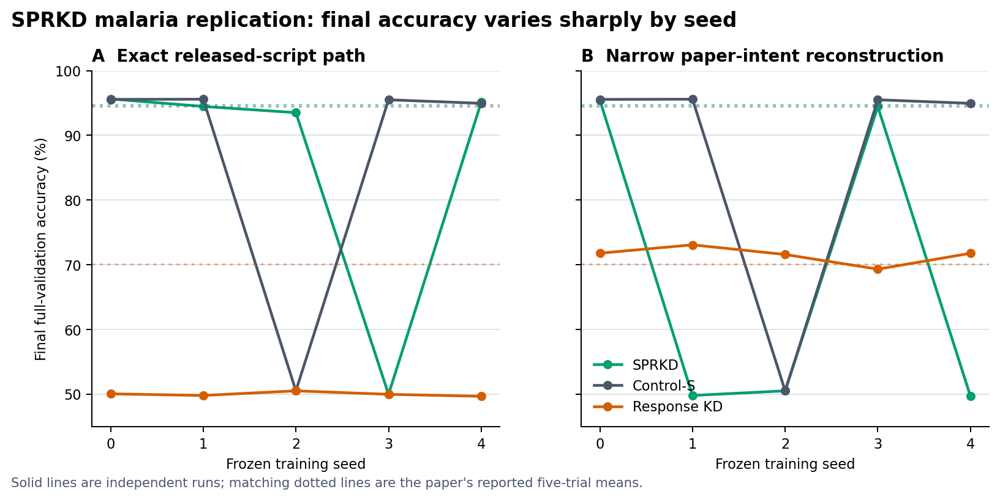

# Independent replication report: SPRKD

Target: [*SPRKD: Effective Knowledge Distillation for Deep Neural Networks via
Saddle Region Approximation*](https://arxiv.org/abs/2607.23346v1), Dewan,
Yogeswaran, and Fedoruk (2026). Code target: the paper-linked
[GitHub repository](https://github.com/thetechdude124/SADDLE-POINT-RECRUITMENT-FOR-KNOWLEDGE-DISTILLATION)
at commit `7f1655ff1295c9a6dcf8d24f6410a036cd7e3497`.

## Bottom line

**Classification: not replicated. Underlying method claim: inconclusive.**
Neither the released artifacts nor the five-seed final outcomes reproduce the
reported combination of a stable 94.80% SPRKD student, parity with Control-S,
and a 24.70-point advantage over weak-teacher RKD. The exact modern public path
averaged 85.742% because one run collapsed to chance; the narrow paper-intent
path averaged 67.977% because three runs collapsed and, on average, it trailed
the unmodified weak-teacher RKD baseline by 3.530 points.

This does not establish that SPRKD itself is false. Every SPRKD run reached at
least 92.61% at some epoch, and the exact-path mean of each run's best retained
batch-mean epoch was 94.827%—strikingly close to the paper's 94.80%. The
release does not identify
whether Table 1 selected best checkpoints, omitted failed finals, or used a
historical implementation with different loss/optimizer behavior. The public
claim is therefore not reproduced; the intended method cannot be confirmed or
disconfirmed without that missing provenance.

This classification applies to the fully tabulated malaria experiment. It is
not a claim that SPRKD is impossible or ineffective under every unreleased
configuration. The historical environment and exact Table 1 implementation
are not recoverable from the public bundle, so conclusions about the proposed
method are kept separate from conclusions about the released reproduction.

## What the paper reports

Table 1 reports five-trial mean validation accuracies of 94.80% for a
6,430-parameter SPRKD student, 94.47% for the same student trained from scratch,
70.10% for response KD, 94.50% for a strong teacher, and 70.13% for a weak
two-epoch teacher. The paper interprets the 24.70-point SPRKD–RKD difference as
evidence that saddle-region distillation escapes a weak teacher's accuracy
ceiling while matching scratch and strong-teacher performance. It also reports
Hessian traces of 33.39, 71.33, and 408.27 for SPRKD, Control-S, and RKD and
argues that SPRKD reaches a flatter, smoother minimum.

We targeted this experiment because it is the paper's only complete numerical
head-to-head table and the upstream README presents the malaria command as the
full reproduction. TinyImageNet, MNIST, and CIFAR-100 remain preliminary,
qualitative, or lack an equivalent five-run end-to-end configuration in the
release; they were not silently reconstructed after seeing results.

## Evidence layers

The protocol froze three primary layers before scratch training:

1. **Released-artifact replay** evaluates the supplied checkpoints, test tensor,
   historical metric traces, and Hessian files without retraining.
2. **Exact public-code track** mirrors the 2026 reproduction path while changing
   only its 10-epoch demonstration default to the paper's 500 epochs and adding
   the reported five-trial loop.
3. **Narrow paper-intent track** preserves the package and hyperparameters but
   corrects two direct prose/code conflicts: SPRKD begins from a fresh random
   student rather than directly at its ASR target, and response KD uses the
   saved two-epoch weak teacher rather than teacher 0 after ASR injection has
   overwritten it.

Seeds 0–4 were fixed in advance. Every seed uses the release's deterministic
75/25 split of all 27,558 images, batch size 64, Adam at 0.001, three weak
teachers trained for two epochs, and 500 student epochs. Final primary metrics
are sample-weighted over all 6,890 validation images. Means, sample standard
deviations, descriptive 95% t intervals over five independent training seeds,
all seed values, and exact within-seed McNemar comparisons are reported. These
intervals estimate run-to-run variation across these five seeds; they are not
prompt bootstraps and they do not establish practical equivalence.

## Released artifacts and source audit

The immutable release does not expose one common state that reproduces Table 1:

- Released checkpoints score 84% SPRKD, 80% Control-S, and 74% RKD on the
  authors' 100-image tensor set.
- The released SPRKD checkpoint scores about 81.64% on its serialized full
  validation indices. Its separate historical trace reconstructs to 94.543%
  final accuracy, while the historical Control-S trace reconstructs to 95.399%.
  Thus that retained trace has Control-S above SPRKD.
- Released Hessian artifacts are 54.96 SPRKD, 35.48 Control-S, and 209.47 RKD,
  not the paper's 33.39, 71.33, and 408.27. RKD remains largest, but the
  SPRKD/Control-S ordering reverses.
- The release notebook's “final epoch” helper strides validation minibatches by
  the number of training steps, so its displayed values are individual
  validation batches rather than epoch aggregates.
- The upstream exact-McNemar helper overflows on some full-split comparisons.
  Our analyzer retains the package contingency table and uses SciPy's stable
  exact binomial calculation, cross-validated against all 2,601 small-count
  cases with discordant cells from zero through 50.

The code/prose audit also found material ambiguity in initialization, weak-
teacher mutation, lowest-loss versus last-snapshot ASR selection, the saddle
criterion, eigenvalue count, epsilon, transformation schedule, stagnation
threshold, NHE/PGD/reversion behavior, and best-versus-final model selection.
Both malaria networks end in `Softmax`; supervised loops then pass probabilities
to `CrossEntropyLoss`, while response KD applies another softmax/log-softmax.
The exact track preserves those behaviors rather than rewriting the target.

## Five-seed scratch results

| Layer/model | Five final accuracies (%) | Mean ± SD | Descriptive 95% t interval | Paper |
|---|---|---:|---:|---:|
| Exact public SPRKD | 95.631, 94.470, 93.512, 49.971, 95.123 | 85.742 ± 20.012 | [60.893, 110.590] | 94.80 |
| Paper-intent SPRKD | 95.472, 49.797, 50.508, 94.441, 49.666 | 67.977 ± 24.634 | [37.390, 98.564] | 94.80 |
| Control-S | 95.559, 95.588, 50.508, 95.501, 94.949 | 86.421 ± 20.078 | [61.491, 111.351] | 94.47 |
| Exact public RKD | 50.044, 49.797, 50.508, 49.971, 49.666 | 49.997 ± 0.322 | [49.598, 50.396] | 70.10 |
| Paper-intent RKD | 71.785, 73.077, 71.582, 69.318, 71.771 | 71.507 ± 1.361 | [69.817, 73.196] | 70.10 |
| Control-T | 95.414, 95.094, 95.123, 95.269, 95.283 | 95.237 ± 0.130 | [95.075, 95.398] | 94.50 |
| Mean of three weak teachers per seed | 70.866, 72.467, 65.186, 72.651, 63.861 | 69.006 ± 4.177 | [63.820, 74.193] | 70.13 |

The wide unbounded t intervals for the three unstable student series include
the paper values, but that fact does not satisfy the frozen decision rule: the
outcomes are mixtures of high-accuracy and chance-level finals, and the
headline ordering/gap fails. In the paper-intent track, SPRKD minus Control-S
was -18.444 points on average and SPRKD minus RKD was -3.530 points. The exact
track's apparent 35.745-point SPRKD advantage over RKD is not the reported
comparison: that path first overwrites the RKD teacher with the ASR, after
which both the mutated teacher and its student remain near 50%.

Best retained batch-mean epoch summaries expose the selection sensitivity.
Exact-path SPRKD's
five-run best-epoch mean was 94.827% (SD 1.027), paper-intent SPRKD's was
94.149% (SD 1.198), and Control-S's was 95.574% (SD 0.391). By the frozen final
metric, however, paper-intent seeds 1, 2, and 4, exact-path seed 3, and
Control-S seed 2 ended near chance. No run was excluded or replaced. The
within-seed McNemar results accordingly change direction: paper-intent SPRKD
beats RKD in seeds 0 and 3 and loses decisively in seeds 1, 2, and 4. We do not
pool tests across their different validation splits.

The primary analyzer refuses incomplete seeds and rechecks every completion
flag, frozen config, dataset partition, stage set, checkpoint/prediction hash,
target count, label range, and prediction-derived accuracy before aggregation.

## Stability, extensions, and curvature

The diagnostics sharpen the failure mode without changing the frozen result:

| Diagnostic | Five-seed result | Reading |
|---|---|---|
| E1: conventional-logit RKD | 71.669% ± 1.443; paired change from released paper-intent RKD +0.163 points, 95% t interval [-0.130, 0.455] | Removing RKD's double-Softmax behavior had little practical effect here. |
| E2: lowest-loss ASR SPRKD | 86.099% ± 20.299; finals 95.573, 49.797, 94.340, 95.283, 95.501 | Lowest-loss selection rescued two collapsed last-snapshot seeds, but one seed still ended at chance; it is not a stable reproduction. |
| D2: supervised logits | SPRKD 94.792% ± 0.193; Control-S 95.152% ± 0.385 | This post-hoc one-change diagnostic removes every observed final collapse and places SPRKD almost exactly on 94.80%, but SPRKD remains 0.360 points below its paired control on average. |
| E3: common-probe Hessian | Full SPRKD < Control-S < RKD ordering in 1/5 exact-path and 2/5 paper-intent seeds | The exploratory scratch checkpoints do not reproduce the paper's qualitative curvature ordering. |

D1 shows why the primary averages are mixtures rather than ordinary noisy
estimates. The mean largest one-epoch accuracy loss was 31.767 points for
exact-path SPRKD and 35.085 for paper-intent SPRKD. Exact seed 3 and intent
seeds 1, 2, and 4 retained permanent best-to-final collapses; several other
runs suffered comparably large transient drops and recovered. Control-S seed 2
also fell 44.409 points from its best retained epoch to its final epoch.

E1 indicates that response KD's double-Softmax implementation is not what
creates the reported SPRKD advantage: conventional logits changed paper-intent
RKD by only +0.163 points on average. E2 is more consequential but still
unstable. Choosing each teacher's lowest recorded saddle loss raised SPRKD by
18.122 points on average relative to last-snapshot selection, with a very wide
descriptive interval [-12.170, 48.414], because seeds 2 and 4 were rescued while
seed 1 remained at chance.

D2 is the strongest constructive finding. Feeding logits—not terminal-Softmax
probabilities—to supervised `CrossEntropyLoss` produced SPRKD finals of
95.109, 94.819, 94.746, 94.615, and 94.673%. Its mean of 94.792% (95% t interval
[94.553, 95.032]) nearly equals the paper's 94.80%, while the paired logit
Control-S averaged 95.152%. SPRKD minus Control-S was -0.360 points on average
(95% t interval [-0.846, 0.126]); this is not an equivalence test. All five
SPRKD optimizers completed their ASR-targeting flags, but none recorded a
negative-Hessian eigenstep. Four retained a nonzero stored-loss marker set by
the perturbation trigger. The result therefore makes the supervised-loss API
violation a plausible cause of the collapses and a high-priority author-intent
question; it does not isolate or confirm the proposed negative-curvature
mechanism, and its post-hoc status prevents it from replacing the primary run.

E3 also fails to validate the curvature account. Under identical Rademacher
probe streams, exact-path SPRKD was below both controls in 2/5 seeds and met the
full paper ordering in only 1/5; the corresponding paper-intent counts were 2/5
and 2/5. The signed estimates were extremely variable, including an exact-path
SPRKD trace estimate of -1911.65 in one seed. All 2,500 probe values are
published. These small-batch, nonconvex Hessian estimates are exploratory and
not numerically comparable to Table 1, but they provide no consistent support
for the claimed ordering.

E1 and E2 were specified before scratch outcomes: conventional pre-Softmax
response KD and lowest-recorded-loss saddle selection, respectively. E3 was
specified after jobs began but before model outcomes were inspected and uses
100 common Rademacher probes on the released 100-image tensor batch. It tests
only curvature ordering, not the paper's under-specified numerical traces.

D1 and D2 are explicitly outcome-motivated post-hoc diagnostics. D1 summarizes
all retained epoch histories after an early seed exposed a collapse. D2 changes
only the terminal activation to `Identity` for paired Control-S and paper-intent
SPRKD runs so supervised cross-entropy receives logits. Neither can alter the
frozen primary classification.

## Claim-by-claim assessment

| Paper claim | Assessment | Evidence |
|---|---|---|
| SPRKD reaches 94.80% over five trials | **Not reproduced as a final outcome.** | Exact and paper-intent means were 85.742% and 67.977%, with one and three chance-level finals. Best retained batch-mean epoch means were much closer, but the historical selection rule is unavailable. |
| SPRKD exceeds weak-teacher RKD by 24.70 points | **Not reproduced under paper intent.** | The mean paired difference was -3.530 points and changed sign by seed. The exact path's +35.745 points uses the ASR-mutated, chance-level teacher rather than the stated weak teacher. |
| RKD remains near the weak-teacher ceiling | **Supported in the narrow reconstruction.** | Unmodified-teacher RKD averaged 71.507% and the per-seed weak-teacher ensemble mean averaged 69.006%; both descriptive intervals contain the paper's values. |
| SPRKD matches Control-S/Control-T to statistical equivalence | **Not established.** | Final SPRKD and Control-S outcomes were unstable and path-dependent. McNemar failure to reject is not an equivalence test without a predeclared margin. |
| SPRKD converges faster and more smoothly | **Not confirmed in the primary tracks.** | Large one-epoch drops and best-to-final collapses occur in both SPRKD tracks. The post-hoc supervised-logit runs are stable, but cannot replace the frozen result or identify the responsible mechanism. |
| SPRKD reaches a flatter minimum than Control-S and RKD | **Not reproduced.** | Released traces differ numerically and reverse SPRKD/Control-S. The common-probe scratch diagnostic reproduced the full ordering in only 1/5 exact-path and 2/5 paper-intent seeds. |
| The result generalizes beyond malaria or to held-out patients | **Not tested here and not established by Table 1.** | Supplementary datasets are preliminary, and the released malaria split is image-random rather than patient-grouped. |

## Citation-use audit

As a separate, non-verdict-bearing audit, Qwen3.6-27B reviewed all 47 unique
bibliography entries across 146 citing-context blocks. A Codex outer teacher
then graded every review against retrieved evidence. Forty-five source
identities were exact; two remained unresolved. The teacher classified 6 uses
as supported, 25 as partially supported, 5 as overstated, 1 as misattributed,
and 10 as unverifiable from acquired evidence. `Unverifiable` does not mean
false.

The local reviewer's mean outer-teacher score was 7.02/10 across 45 evaluable
items, but 27 had a critical review error. The automation gate therefore
remains closed: Qwen's traces are useful supervised training material, not an
independent authority. Public results expose verdicts and immutable trace
hashes; raw packets remain private because they include retrieved source text.

## Limitations and reproducibility

Five seeds are enough to expose instability but not to estimate a multimodal
failure probability precisely. The unbounded t intervals assume a roughly
mean-like sampling distribution and are poor summaries of a high/chance
mixture; every seed and best/final pair is therefore primary context. GPU and
CUDA stacks differed across hosts, as recorded, and upstream does not request
deterministic algorithms. That nuisance can affect exact trajectories. The
chance-level finals occurred on both shared-host GPU architectures, while only
one seed ran on the workstation GPU, so this design cannot estimate a hardware
effect or use hardware as an explanation for the mixed terminal behavior.

The exact historical Table 1 revision, environment, seeds, per-trial records,
checkpoint-selection rule, and failed-run policy are missing. Track C corrects
only two explicit prose/code conflicts and is not a reconstruction of all
ambiguous optimizer choices. D1/D2 are outcome-motivated and descriptive; E3
uses a small fixed 100-image batch and tests ordering rather than the paper's
numerical curvature values. The extension configs for the first two started
seeds bind their completed base result/config/split but do not embed the three
teacher checkpoint hashes directly; the validated public run index supplies
those hashes, and the next runner must embed every direct input before launch.

The original dataset, checkpoints, and logs are intentionally outside ordinary
Git history. `SOURCE_MANIFEST.md` provides immutable input digests and
acquisition routes; the code repository declares MIT, the paper is CC BY 4.0,
and the NLM image archive is reacquired from its official public endpoint
rather than redistributed without an explicit image-license statement.

The study includes frozen protocols, source and execution hashes, hash-pinned
dependencies, resumable runners, fail-closed analyzers, run-level derived JSON,
a complete origin-separated error ledger, and a CUDA 12.8 container recipe.
Docker and Podman were unavailable on the experiment hosts, so the container
syntax and lock were checked but an image build is not represented as tested.
The public templates replace machine-specific paths and GPU UUIDs with required
environment inputs; executed and published shell hashes are paired in the
manifest.

Most importantly, the protocol was timestamped and frozen in the working tree
before training but was not committed to Git before execution. Run configs,
logs, and code hashes bind what ran, and the decision rule was not changed, but
Git history alone cannot prove preregistration timing. That is our process
error, not an upstream finding, and future studies require a pushed protocol
commit before compute begins.

The completed release candidate is separately governed by a one-shot final
peer review. Fable reviews one committed evidence packet and returns `PASS`,
`FAIL`, or `HARD_FAIL`; it does not rerun the study or alter the frozen verdict.
A normal `FAIL` contains exactly three corrections, which are closed and
validated once before publication without resubmission. Only `HARD_FAIL`
requires human review of publication. Every author email has an additional
mandatory final human gate: Fable can make the exact draft eligible for review
but cannot authorize or send it. The review record is process provenance, not
scientific evidence.

The one permitted Fable invocation was refused by its biomedical-content
safeguard before any substantive review was returned. The frozen gate therefore
records a technical `HARD_FAIL` and requires human review; no resubmission will
occur. This process outcome does not change the **Not replicated** public-result
assessment or the **Inconclusive** underlying-method assessment.

## Constructive author follow-up

`AUTHOR_QUESTIONS.md` requests the historical code/environment, per-seed
outcomes, initialization and ASR-selection behavior, exact supervised and KD
loss inputs, checkpoint-selection rule, and Hessian provenance. An author
response can define a new, prospectively frozen intent track; it will not erase
this result. `AUTHOR_EMAIL.md` is a draft only and has not been sent.
